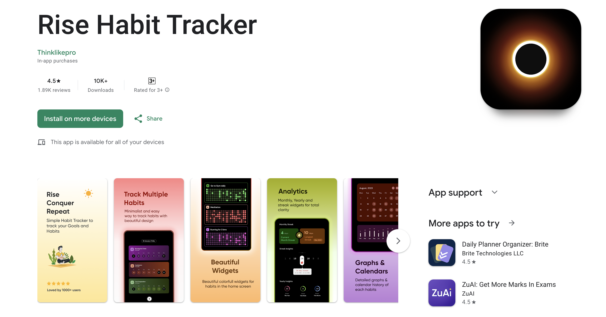

# Rise - Habit Tracker App Flutter



## Overview

Rise is a habit tracker app inspired by a hidden gem category app on the Play Store, which was awarded the App of the Year 2024. I found this app simple and easy to develop in Flutter, and it can be done in one day. Therefore, I decided to recreate this app using Flutter to showcase the power of Flutter and how easy it is to develop apps using Flutter with the ABCD Architecture.

[Play Store App URL](https://play.google.com/store/apps/details?id=com.habittracker.routine.habits.dailyplanner)

## Architecture

This project uses the ABCD Architecture to fast-track the development process. For more details on the architecture, you can visit the following repository:

[ABCD Architecture Flutter](https://github.com/SuTechs/abcd_architecture_flutter)

## Getting Started

To get started with the project, follow these steps:

1. Clone the repository:
    ```sh
    git clone https://github.com/SuTechs/rise.git
    ```
2. Navigate to the project directory:
    ```sh
    cd rise
    ```
3. Install the dependencies:
    ```sh
    flutter pub get
    ```
4. Run the app:
    ```sh
    flutter run
    ```

## YouTube Video

I will also be uploading a video on YouTube demonstrating the development process of this app. Make sure to check it out and subscribe to my channel for more content.

[YouTube Channel](https://www.youtube.com/@sutechsdev)

## License

This project is licensed under the MIT License - see the [LICENSE](LICENSE) file for details.